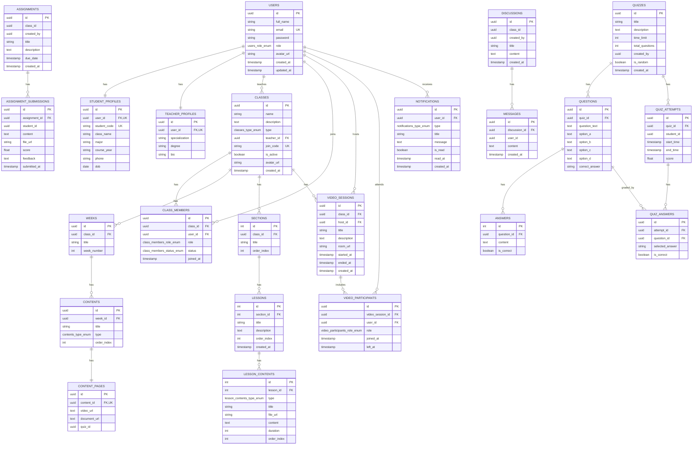

# IT4409 Database ERD (Mermaid)

## Dieu huong nhanh

- Tong quan schema chi tiet: [docs/database_schema.md](docs/database_schema.md)
- ERD day du (file hien tai): [docs/database_erd.md](docs/database_erd.md)
- ERD tach nho theo domain: [docs/database_erd_split.md](docs/database_erd_split.md)

Tai lieu nay la ERD tong hop theo migration hien tai.

Nguon:
- backend/src/migrations/1775881197833-InitSchema.ts
- backend/src/migrations/1775881761133-AddClassAvatarUrl.ts

## Full ERD

## Notes

1. So do tren the hien quan he FK hien co trong migration.
2. Mot so cot mang y nghia lien ket nhung chua co FK constraint trong DB:
   - assignments.class_id
   - assignments.created_by
   - assignment_submissions.student_id
   - quizzes.created_by
   - quiz_attempts.student_id
   - discussions.class_id
   - discussions.created_by
   - messages.user_id
   - content_pages.quiz_id
3. Cac cap one-to-one duoc enforce bang UNIQUE tren cot FK:
   - student_profiles.user_id
   - teacher_profiles.user_id
   - content_pages.content_id
4. Cac unique index tong hop quan trong:
   - class_members (class_id, user_id)
   - video_participants (video_session_id, user_id)
