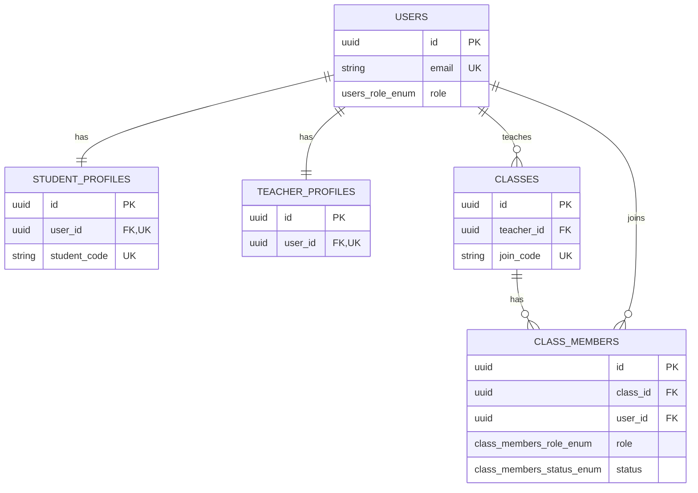
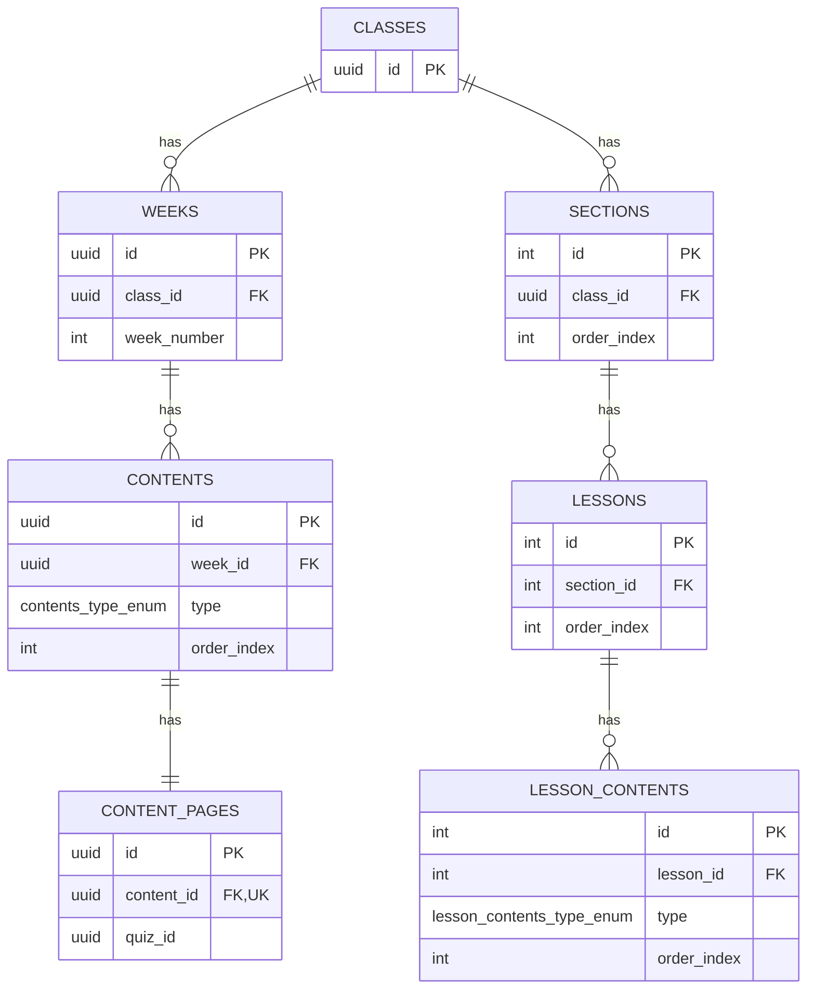
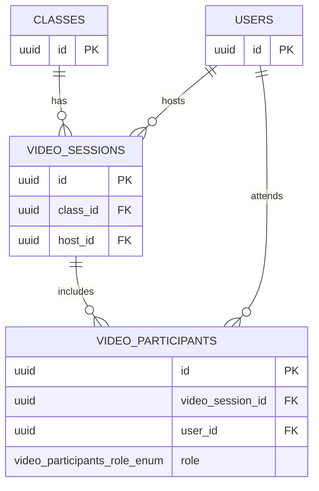
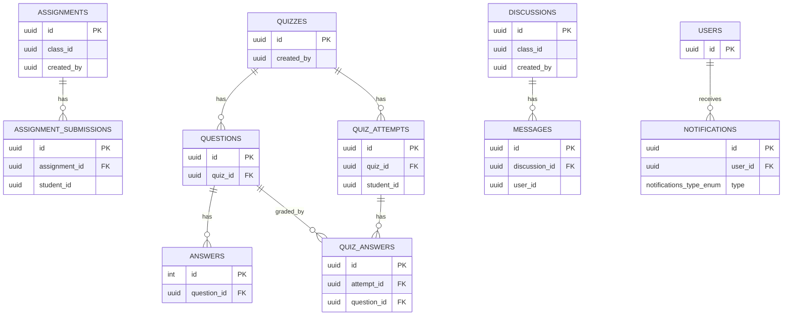

# IT4409 Database ERD (Split by Domain)

## Dieu huong nhanh

- Tong quan schema chi tiet: [docs/database_schema.md](docs/database_schema.md)
- ERD day du (1 so do lon): [docs/database_erd.md](docs/database_erd.md)
- ERD tach nho theo domain (file hien tai): [docs/database_erd_split.md](docs/database_erd_split.md)

File nay tach ERD thanh nhieu khoi nho de Markdown Preview render on dinh hon.

Nguon schema:
- backend/src/migrations/1775881197833-InitSchema.ts
- backend/src/migrations/1775881761133-AddClassAvatarUrl.ts

## 1) Identity + Class Membership

## 2) Learning Content Hierarchy

## 3) Live Video Session

## 4) Assignment + Quiz + Discussion + Notification

## Notes

1. File nay uu tien kha nang render trong VS Code hon la hien thi day du moi cot.
2. So do full van o docs/database_erd.md.
3. Nhung cot co y nghia lien ket nhung chua co FK constraint van duoc ghi chu trong docs/database_schema.md.
